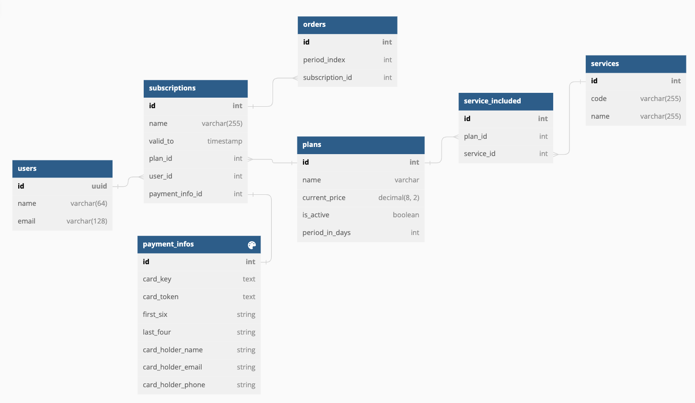

# SAAS Subscription Server

### Inspired by

[A SaaS Subscription Data Model](https://vertabelo.com/blog/a-saas-subscription-data-model/)

### Prerequisite

- Node.js 16.19.0
- Docker
- MySQL

### Local Development

- Prepare MySQL Environment
- Fill in all environment defined in .env.development
- npm install
- npm run dev

### ER Diagram 
